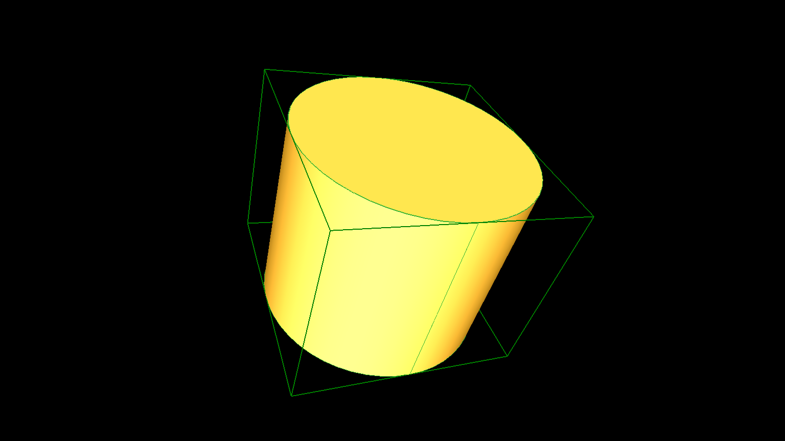
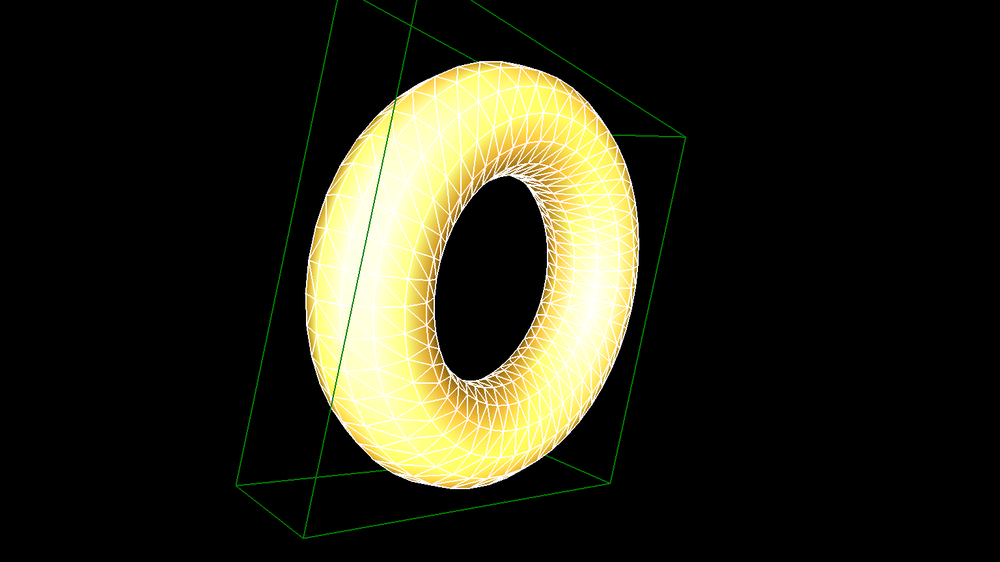

# occBasicSamples

Very basic [OpenCASCADE](https://www.opencascade.com) examples that compile on Linux on the commandline with g++.
A .stl, .wrl and .stp file is written into a file which can be imported and viewed by a program like [blender](https://www.blender.org), [MeshLab](http://www.meshlab.net), [FreeCAD](https://www.freecadweb.org) or [view3dscene](https://castle-engine.sourceforge.io/view3dscene.php) for example.
The purpose of these tiny example programs is to show the most basic usage of the Open CASCADE 3D library possible, thus flattening the learning curve for a beginner (like me).
 

## Installation - tested on ArchLinux
		```
	* Download OpenCascade from https://github.com/Open-Cascade-SAS/OCCT/releases/tag/V7_8_1. 
	* Configure
		```
		tar -xvzf V7_8_1.tar.gz
		cd V7_8_1
		mkdir install
		mkdir build
		```
		user> cd build && ccmake ../
		```
		* Adapt and configure the variables as you need them. 
		* Press the c key several times in order to solve all dependencies and generate the makefiles with the g-key then.
		* Here is what i have changed:
				> INSTALL_DIR                      ../install                                                                                                                                                
				> 3RDPARTY_SKIP_DOT_EXECUTABLE     OFF
				> INSTALL_DOC_Overview             ON                                                                                                                                                  
				> INSTALL_FREETYPE                 ON  
				> INSTALL_SAMPLES                  ON                                                                                                                                                        
				> INSTALL_TCL                      ON                                                                                                                                                        
				> INSTALL_TEST_CASES               ON                                                                                                                                                        
				> INSTALL_TK                       ON                                                                                                                                                        
				> USE_FREEIMAGE                    ON                                                                                                                                                        
				> USE_GL2PS                        ON                                                                                                                                                        
				> USE_TBB                          ON                                                                                                                                                        
				> USE_VTK                          ON
	* Compile:
		```
		make
		```
		``` 
* occBasicSamples
	```
	git clone https://github.com/quirxi/occBasicSamples.git
	cd occBasicSamples/src
	rm include lib path_to_OpenCascade_*
	ln -s /home/tulip/OCCT/install/lib/ lib
	ln -s /home/tulip/OCCT/install/include/ include
	cd Box
	make
	./aBox.exe 
	 ls -a
			.  ..  aBox.exe  aBox.stl  aBox.wrl  main.cpp  main.o  Makefile
	
	```	


## Available examples

Up to now there are examples for following basic shapes available:

**`Box:`**


**`Circle:`**


**`Cone:`**


**`Cylinder:`**


**`Sphere:`**


**`Torus:`**


## References

* https://github.com/eryar/occQt
* https://occtutorials.wordpress.com/
* http://www.creativecadtechnology.com/OCC/ShowScript?userName=gvh&groupName=demo&scriptName=MakeBottle
* https://www.opencascade.com
* https://www.opencascade.com/doc/occt-7.1.0/overview/html/index.html
* https://www.opencascade.com/doc/occt-7.1.0/overview/html/occt_dev_guides__building_3rdparty_linux.html
* https://www.blender.org
* http://www.meshlab.net
* https://www.freecadweb.org
* https://castle-engine.sourceforge.io/view3dscene.php


## Authors:

* quirxi (https://github.com/quirxi)
* updated by mztulip


## License

Distributed under the MIT License.


